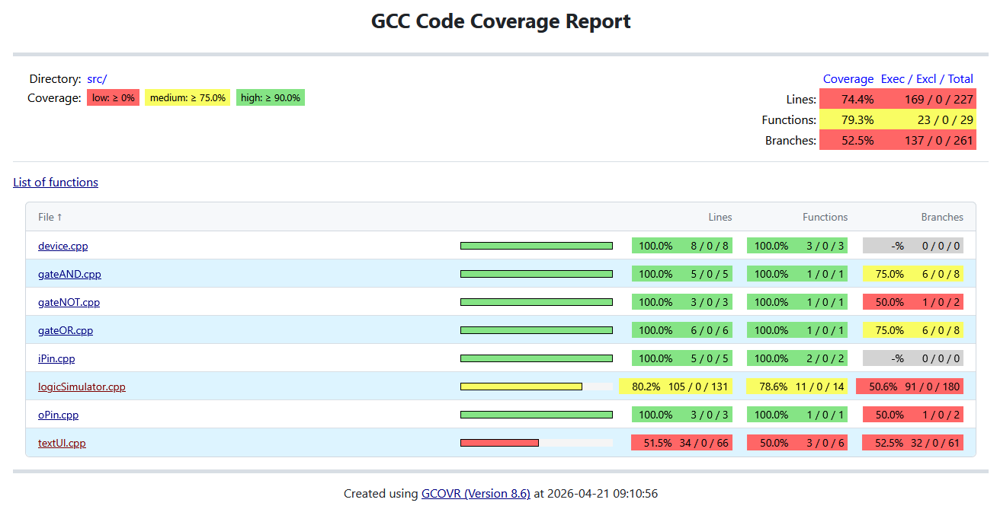

# LogicSimulator
This project is for simulating logic circuit.  
Reading a Logic-Circuit-File(lcf) to get truth table or i/o simulation.

## Logic Circuit File
File format:
```  
<Input pins amount>
<Logic gates amount>
logic gate #1
logic gate #2
...
```
logic gate expression:  
```
<gatetype> <input pins> 0 
``` 
gatetype: 1-AND 2-NOT 3-OR  
input pin:
- circuit's input pin: "-x"   x=input pin numer
- output from other gate: "x.1"  x=logic gate number


here is an example:  
```
3                //3 input pins
3                //3 logic gates
1 -1 2.1 3.1 0   //Gate#1, an AND gate(1), Input pin#1 & Output pins of gate2,3 are connected.
3 -2 0           //Gate#2, an NOT gate(3), Input pin#2 is connected.
2 2.1 -3 0       //Gate#3, an OR gate(2), Output pin of gate2 & Input pin#3 are connected.
```

## Test code Coverage
